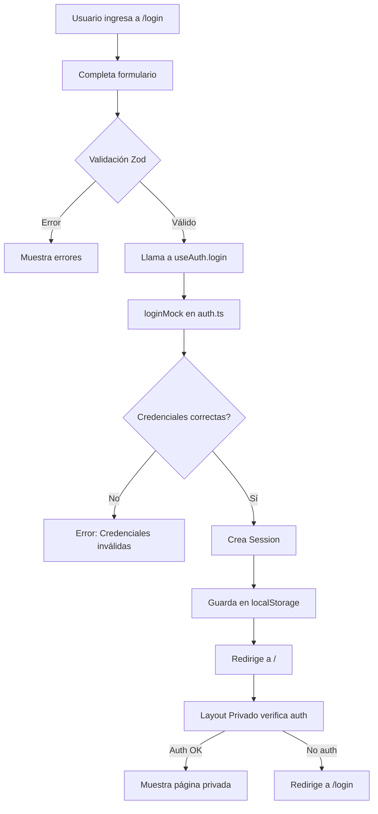

# AFLOW Portal - Documentación del Proyecto Base

## 📋 Índice

1. [Visión General](#visión-general)
2. [Arquitectura](#arquitectura)
3. [Estructura de Directorios](#estructura-de-directorios)
4. [Sistema de Autenticación](#sistema-de-autenticación)
5. [Componentes UI](#componentes-ui)
6. [Estilos y Diseño](#estilos-y-diseño)
7. [Utilidades](#utilidades)
8. [Flujo de Navegación](#flujo-de-navegación)
9. [Deployment](#deployment)
10. [Extensión del Proyecto](#extensión-del-proyecto)

---

## 🎯 Visión General

### Propósito

**AFLOW Portal Base** es la versión fundacional del sistema corporativo AFLOW, diseñada para ser:

- ✅ Completamente funcional desde el día 1
- ✅ Lista para despliegue en Vercel sin configuración adicional
- ✅ Extensible para agregar nuevos módulos
- ✅ Libre de errores y warnings de compilación
- ✅ Optimizada para rendimiento y UX

### Alcance de la Versión Base

**Incluye:**
- Landing Page profesional y responsiva
- Sistema de autenticación mock funcional
- Layout global y layout privado protegido
- Componentes UI con shadcn/ui
- Utilidades comunes (formateo, validación)
- Logging estructurado
- Configuración TypeScript estricta
- Integración TailwindCSS con paleta corporativa

**NO Incluye (extensiones futuras):**
- Dashboard con métricas
- Módulos CRUD (Contratante, Cotización, etc.)
- API Routes backend
- Integración Supabase real
- Sistema de notificaciones avanzado
- Gestión de roles y permisos granulares

---

## 🏗️ Arquitectura

### Principios de Diseño

1. **Clean Architecture:** Separación de responsabilidades en capas
2. **Server Components First:** Uso de RSC de Next.js 15
3. **Client Components Only When Needed:** Hooks, estado, eventos
4. **Type Safety:** TypeScript estricto en toda la aplicación
5. **Mobile-First:** Diseño responsivo desde el inicio

### Capas de la Aplicación

```
┌─────────────────────────────────────────┐
│     Presentación (app/, components/)    │
│  - Pages (RSC)                          │
│  - Layouts                              │
│  - UI Components                        │
└─────────────────────────────────────────┘
              ↓
┌─────────────────────────────────────────┐
│     Lógica de Negocio (hooks/, lib/)   │
│  - Custom Hooks (useAuth)               │
│  - Utilities                            │
│  - Validaciones                         │
└─────────────────────────────────────────┘
              ↓
┌─────────────────────────────────────────┐
│     Datos (data/)                       │
│  - Supabase Client                      │
│  - Auth Mock                            │
│  - (Future: API Services)               │
└─────────────────────────────────────────┘
```

### Tecnologías Core

| Categoría | Tecnología | Versión | Propósito |
|-----------|-----------|---------|-----------|
| Framework | Next.js | 15.0.3 | App Router, RSC, SSR |
| Language | TypeScript | 5.3.3 | Type Safety |
| Styling | TailwindCSS | 3.4.1 | Utility CSS |
| UI Library | shadcn/ui | Latest | Component System |
| Forms | React Hook Form | 7.49.3 | Form Management |
| Validation | Zod | 3.22.4 | Schema Validation |
| Backend | Supabase | 2.39.3 | Auth & Database |
| Logging | Pino | 8.17.2 | Structured Logs |

---

## 📂 Estructura de Directorios

### Descripción Detallada

```
aflow-portal/
│
├── app/                          # App Router de Next.js 15
│   ├── (public)/                 # Route Group: Rutas públicas
│   │   ├── page.tsx              # Landing Page (/)
│   │   └── login/
│   │       └── page.tsx          # Login Page (/login)
│   │
│   ├── (private)/                # Route Group: Rutas privadas
│   │   ├── layout.tsx            # Layout con auth guard
│   │   └── page.tsx              # Home privado (/)
│   │
│   ├── layout.tsx                # Root layout (fuentes, metadata)
│   └── globals.css               # Estilos globales + Tailwind
│
├── components/
│   ├── layout/                   # Componentes de layout
│   │   ├── Header.tsx            # Header público
│   │   ├── Footer.tsx            # Footer
│   │   └── NavPublic.tsx         # Navegación pública
│   │
│   └── ui/                       # shadcn/ui components
│       ├── button.tsx
│       ├── input.tsx
│       ├── card.tsx
│       ├── form.tsx
│       ├── label.tsx
│       └── separator.tsx
│
├── hooks/
│   └── useAuth.ts                # Hook de autenticación
│
├── lib/
│   ├── utils.ts                  # Utilidades generales
│   ├── env.ts                    # Variables de entorno
│   └── pino-client.ts            # Logger configurado
│
├── data/
│   └── supabase/
│       ├── client.ts             # Cliente Supabase
│       └── auth.ts               # Lógica de auth mock
│
├── types/
│   └── index.d.ts                # Tipos TypeScript globales
│
├── public/
│   ├── logo-aflow.svg            # Logo corporativo
│   └── favicon.ico               # Favicon
│
├── .env.local                    # Variables de entorno (local)
├── .env.example                  # Template de .env
├── .gitignore                    # Git ignore
├── components.json               # Config de shadcn/ui
├── next.config.ts                # Config de Next.js
├── package.json                  # Dependencies
├── postcss.config.js             # PostCSS
├── tailwind.config.ts            # Tailwind config
├── tsconfig.json                 # TypeScript config
└── README.md                     # Documentación principal
```

---

## 🔐 Sistema de Autenticación

### Flujo de Autenticación Mock



### Componentes del Sistema Auth

#### 1. **useAuth Hook** (`hooks/useAuth.ts`)

Hook principal para gestión de autenticación:

```typescript
const { 
  user,              // Usuario actual
  session,           // Sesión activa
  isLoading,         // Estado de carga
  isAuthenticated,   // Boolean de auth
  login,             // Función login
  logout,            // Función logout
  checkAuth          // Verificar auth
} = useAuth();
```

#### 2. **Auth Mock** (`data/supabase/auth.ts`)

Funciones de autenticación simulada:

- `loginMock()` - Valida credenciales y crea sesión
- `getSession()` - Obtiene sesión de localStorage
- `logoutMock()` - Limpia sesión
- `isAuthenticated()` - Verifica estado de auth

#### 3. **Credenciales de Prueba**

```typescript
Email: test@aflow.cl
Password: 123456
```

Usuario mock completo:

```typescript
{
  id: "1",
  email: "test@aflow.cl",
  nombre: "Usuario",
  apellido: "Demo",
  role: "admin",
  cargo: "Administrador",
  departamento: "TI"
}
```

### Protección de Rutas

El layout privado (`app/(private)/layout.tsx`) verifica autenticación:

```typescript
"use client";

export default function PrivateLayout({ children }) {
  const { isAuthenticated, isLoading } = useAuth();

  useEffect(() => {
    if (!isLoading && !isAuthenticated) {
      router.push("/login");
    }
  }, [isAuthenticated, isLoading]);

  // ... rest of component
}
```

### Migración a Supabase Auth Real

Para reemplazar el mock con Supabase real:

1. **Actualizar `data/supabase/auth.ts`:**

```typescript
import { supabase } from './client';

export async function login(credentials: LoginCredentials) {
  const { data, error } = await supabase.auth.signInWithPassword({
    email: credentials.email,
    password: credentials.password,
  });
  
  return { session: data.session, error: error?.message };
}

export async function logout() {
  await supabase.auth.signOut();
}

export function getSession() {
  return supabase.auth.getSession();
}
```

2. **Actualizar variables de entorno:**

```env
NEXT_PUBLIC_SUPABASE_URL=https://xxxxx.supabase.co
NEXT_PUBLIC_SUPABASE_ANON_KEY=eyJhbG...
```

3. **Configurar políticas RLS en Supabase**

---

## 🎨 Componentes UI

### shadcn/ui Components

Todos los componentes siguen el patrón de shadcn/ui: copiables, customizables, accesibles.

#### Button

```tsx
import { Button } from "@/components/ui/button";

<Button variant="default">Click me</Button>
<Button variant="destructive">Delete</Button>
<Button variant="outline">Outline</Button>
<Button variant="ghost">Ghost</Button>
```

#### Card

```tsx
import { Card, CardHeader, CardTitle, CardContent } from "@/components/ui/card";

<Card>
  <CardHeader>
    <CardTitle>Título</CardTitle>
  </CardHeader>
  <CardContent>
    Contenido
  </CardContent>
</Card>
```

#### Form (con React Hook Form + Zod)

```tsx
import { useForm } from "react-hook-form";
import { zodResolver } from "@hookform/resolvers/zod";
import * as z from "zod";
import { Form, FormField, FormItem, FormLabel, FormControl } from "@/components/ui/form";
import { Input } from "@/components/ui/input";

const schema = z.object({
  email: z.string().email(),
});

function MyForm() {
  const form = useForm({
    resolver: zodResolver(schema),
  });

  return (
    <Form {...form}>
      <FormField
        control={form.control}
        name="email"
        render={({ field }) => (
          <FormItem>
            <FormLabel>Email</FormLabel>
            <FormControl>
              <Input {...field} />
            </FormControl>
          </FormItem>
        )}
      />
    </Form>
  );
}
```

### Layout Components

#### Header

- Logo AFLOW
- Navegación pública
- Sticky positioning
- Backdrop blur effect

#### Footer

- Copyright dinámico
- Links de utilidad
- Responsive layout

#### NavPublic

- Link "Inicio"
- Botón CTA "Iniciar Sesión"

---

## 🎨 Estilos y Diseño

### Paleta de Colores AFLOW

Definida en `tailwind.config.ts`:

```typescript
colors: {
  aflow: {
    orange: "#FF7A00",  // Color principal de marca
    black: "#000000",
    white: "#FFFFFF",
  },
  gray: {
    dark: "#1A1A1A",    // Texto principal
    medium: "#4D4D4D",   // Texto secundario
    light: "#EDEDED",    // Fondos
  },
}
```

### Uso en Componentes

```tsx
<div className="bg-aflow-orange text-white">
  CTA Button
</div>

<p className="text-gray-dark">
  Texto principal
</p>

<button className="hover:text-aflow-orange">
  Hover effect
</button>
```

### Tipografía

Fuentes configuradas en `app/layout.tsx`:

- **Poppins:** Títulos y encabezados (weights: 400, 500, 600, 700)
- **Inter:** Texto de cuerpo

Clases Tailwind personalizadas:

```typescript
fontSize: {
  h1: ["3.5rem", { lineHeight: "1.2", fontWeight: "700" }],  // 56px
  h2: ["2.25rem", { lineHeight: "1.3", fontWeight: "600" }], // 36px
  h3: ["1.75rem", { lineHeight: "1.4", fontWeight: "500" }], // 28px
  body: ["1.125rem", { lineHeight: "1.6", fontWeight: "400" }], // 18px
  small: ["0.875rem", { lineHeight: "1.5", fontWeight: "400" }], // 14px
}
```

Uso:

```tsx
<h1 className="text-h1 font-poppins">Título Grande</h1>
<p className="text-body font-inter">Párrafo de texto</p>
```

### CSS Variables (shadcn/ui)

Definidas en `app/globals.css`:

```css
:root {
  --background: 0 0% 100%;
  --foreground: 0 0% 3.9%;
  --primary: 24 100% 50%;       /* AFLOW Orange */
  --primary-foreground: 0 0% 100%;
  /* ... más variables */
}
```

Uso:

```tsx
<div className="bg-primary text-primary-foreground">
  Usando variables CSS
</div>
```

### Responsividad

Breakpoints de Tailwind:

- **sm:** 640px
- **md:** 768px
- **lg:** 1024px
- **xl:** 1280px
- **2xl:** 1400px (custom en container)

Ejemplo:

```tsx
<div className="grid grid-cols-1 md:grid-cols-2 lg:grid-cols-3">
  {/* Mobile: 1 col, Tablet: 2 cols, Desktop: 3 cols */}
</div>
```

---

## 🛠️ Utilidades

### `lib/utils.ts`

#### cn() - Class Name Merger

```typescript
import { cn } from "@/lib/utils";

<div className={cn(
  "base-class",
  isActive && "active-class",
  "hover:opacity-80"
)}>
```

#### formatRut() - Formateo de RUT Chileno

```typescript
import { formatRut } from "@/lib/utils";

formatRut("123456789"); 
// Output: "12.345.678-9"
```

#### validateRut() - Validación Módulo 11

```typescript
import { validateRut } from "@/lib/utils";

validateRut("12.345.678-9");
// Output: true/false
```

#### debounce() - Rate Limiting

```typescript
import { debounce } from "@/lib/utils";

const handleSearch = debounce((query: string) => {
  // API call
}, 500);
```

#### formatDate() - Fecha Chilena

```typescript
import { formatDate } from "@/lib/utils";

formatDate(new Date());
// Output: "09/12/2025"
```

#### formatCurrency() - Pesos Chilenos

```typescript
import { formatCurrency } from "@/lib/utils";

formatCurrency(1500000);
// Output: "$1.500.000"
```

### `lib/env.ts`

Validación de variables de entorno:

```typescript
import { env, validateEnv } from "@/lib/env";

// Uso
const supabaseUrl = env.supabase.url;
const appUrl = env.app.url;

// Validación
validateEnv(); // Retorna true/false
```

### `lib/pino-client.ts`

Logger estructurado:

```typescript
import { log } from "@/lib/pino-client";

log.info("Usuario autenticado", { userId: "123" });
log.error("Error en login", new Error("Invalid credentials"));
log.warn("Sesión por expirar");
log.debug("Debug info");
```

---

## 🗺️ Flujo de Navegación

### Rutas Públicas

| Ruta | Componente | Descripción |
|------|-----------|-------------|
| `/` | `app/(public)/page.tsx` | Landing Page con Hero, Features, CTA |
| `/login` | `app/(public)/login/page.tsx` | Formulario de autenticación |

### Rutas Privadas

| Ruta | Componente | Descripción |
|------|-----------|-------------|
| `/` (autenticado) | `app/(private)/page.tsx` | Página maestra privada |

### Flujo Completo

1. **Usuario no autenticado accede a `/`:**
   - Ve Landing Page pública
   - Click en "Iniciar Sesión" → `/login`

2. **Usuario en `/login`:**
   - Completa formulario
   - Validación con Zod
   - Submit → `useAuth.login()`
   - Si éxito → redirect a `/` (private)
   - Si error → muestra toast de error

3. **Usuario autenticado en `/`:**
   - Layout privado verifica sesión
   - Si válida → muestra página privada
   - Si inválida → redirect a `/login`

4. **Usuario cierra sesión:**
   - Click en "Cerrar Sesión"
   - `useAuth.logout()`
   - Limpia localStorage
   - Redirect a `/login`

---

## 🚀 Deployment

### Despliegue en Vercel (Recomendado)

#### Paso 1: Preparar Repositorio

```bash
git add .
git commit -m "feat: AFLOW Portal base ready for deployment"
git push origin main
```

#### Paso 2: Importar en Vercel

1. Ve a [vercel.com/new](https://vercel.com/new)
2. Conecta tu cuenta de GitHub
3. Selecciona el repositorio `front-sistem-portal-aflow-nextjs`
4. Click "Import"

#### Paso 3: Configuración Automática

Vercel detecta automáticamente:
- ✅ Framework: Next.js
- ✅ Build Command: `next build`
- ✅ Output Directory: `.next`
- ✅ Install Command: `npm install`

#### Paso 4: Variables de Entorno (Opcional)

Si usas Supabase real, agrega en Vercel Dashboard:

```
NEXT_PUBLIC_SUPABASE_URL=https://xxx.supabase.co
NEXT_PUBLIC_SUPABASE_ANON_KEY=eyJhbG...
NEXT_PUBLIC_APP_URL=https://your-domain.vercel.app
```

#### Paso 5: Deploy

Click "Deploy" → Vercel compila y despliega automáticamente.

### Verificación Post-Deploy

1. **Homepage:** `https://your-domain.vercel.app/`
2. **Login:** `https://your-domain.vercel.app/login`
3. **Autenticación:** Probar con `test@aflow.cl` / `123456`
4. **Área privada:** Verificar redirección post-login

### CI/CD Automático

Cada push a `main` dispara deploy automático en Vercel:

```bash
git push origin main  # Auto-deploy
```

Para crear preview deployments:

```bash
git checkout -b feature/nueva-funcionalidad
git push origin feature/nueva-funcionalidad  # Preview URL generada
```

---

## 🔧 Extensión del Proyecto

### Roadmap de Módulos Futuros

#### 1. Dashboard Module

```
app/(private)/
└── dashboard/
    ├── page.tsx              # Vista del dashboard
    ├── components/
    │   ├── MetricCard.tsx
    │   ├── Chart.tsx
    │   └── RecentActivity.tsx
    └── hooks/
        └── useDashboardData.ts
```

**Features:**
- Métricas en tiempo real
- Gráficos con Recharts
- Tarjetas de resumen
- Actividad reciente

#### 2. Módulo Contratante (CRUD)

```
app/(private)/
└── contratante/
    ├── page.tsx              # Lista de contratantes
    ├── nuevo/
    │   └── page.tsx          # Crear contratante
    ├── [id]/
    │   ├── page.tsx          # Ver detalle
    │   └── editar/
    │       └── page.tsx      # Editar contratante
    └── components/
        ├── ContratanteForm.tsx
        ├── ContratanteTable.tsx
        └── ContratanteFilters.tsx
```

**Features:**
- CRUD completo
- Validación de RUT
- Búsqueda y filtros
- Paginación
- Exportar a Excel

#### 3. API Routes

```
app/api/
├── auth/
│   ├── login/route.ts
│   ├── logout/route.ts
│   └── session/route.ts
├── contratante/
│   ├── route.ts              # GET, POST
│   └── [id]/
│       └── route.ts          # GET, PUT, DELETE
└── healthcheck/
    └── route.ts
```

**Features:**
- RESTful API
- Middleware de autenticación
- Rate limiting
- Error handling

#### 4. Sistema de Roles y Permisos

```typescript
// types/permissions.ts
export interface Permission {
  module: string;
  actions: ("read" | "create" | "update" | "delete")[];
}

export const ROLE_PERMISSIONS: Record<UserRole, Permission[]> = {
  admin: [
    { module: "contratante", actions: ["read", "create", "update", "delete"] },
    { module: "cotizacion", actions: ["read", "create", "update", "delete"] },
  ],
  analista: [
    { module: "contratante", actions: ["read", "create", "update"] },
    { module: "cotizacion", actions: ["read", "create"] },
  ],
  operador: [
    { module: "contratante", actions: ["read"] },
  ],
};
```

#### 5. Testing Suite

```
__tests__/
├── unit/
│   ├── utils.test.ts
│   ├── auth.test.ts
│   └── components/
│       ├── Button.test.tsx
│       └── Card.test.tsx
├── integration/
│   ├── login.test.tsx
│   └── contratante-crud.test.tsx
└── e2e/
    └── user-journey.spec.ts
```

**Setup:**

```bash
npm install -D jest @testing-library/react @testing-library/jest-dom
npm install -D @playwright/test  # E2E tests
```

### Patrón para Agregar Nuevos Módulos

1. **Crear estructura de directorios:**

```bash
mkdir -p app/(private)/nuevo-modulo
mkdir -p app/(private)/nuevo-modulo/components
```

2. **Crear página principal:**

```tsx
// app/(private)/nuevo-modulo/page.tsx
export default function NuevoModuloPage() {
  return (
    <div>
      <h1>Nuevo Módulo</h1>
    </div>
  );
}
```

3. **Agregar navegación:**

```tsx
// components/layout/Sidebar.tsx (crear si no existe)
<nav>
  <Link href="/dashboard">Dashboard</Link>
  <Link href="/nuevo-modulo">Nuevo Módulo</Link>
</nav>
```

4. **Crear tipos:**

```typescript
// types/nuevo-modulo.ts
export interface NuevoModulo {
  id: string;
  nombre: string;
  // ... más campos
}
```

5. **Crear hook de datos:**

```typescript
// hooks/useNuevoModulo.ts
export function useNuevoModulo() {
  const [data, setData] = useState([]);
  const [loading, setLoading] = useState(false);

  // ... lógica de fetch, create, update, delete

  return { data, loading, create, update, remove };
}
```

### Mejores Prácticas

- ✅ Usa Server Components por defecto
- ✅ Client Components solo cuando necesites interactividad
- ✅ TypeScript estricto siempre
- ✅ Validación con Zod en todos los forms
- ✅ Error boundaries para manejo de errores
- ✅ Loading states y Suspense
- ✅ Optimistic updates en mutaciones
- ✅ Logging estructurado con Pino
- ✅ Tests unitarios para utilidades
- ✅ Tests E2E para flujos críticos

---

## 📊 Métricas de Calidad

### Checklist de Calidad del Proyecto Base

- ✅ **Zero TypeScript Errors:** `npm run type-check` → Sin errores
- ✅ **Zero ESLint Errors:** `npm run lint` → Sin errores
- ✅ **Build Success:** `npm run build` → Compilación exitosa
- ✅ **Dev Server:** `npm run dev` → Sin warnings
- ✅ **Responsive Design:** Mobile, Tablet, Desktop
- ✅ **Accessibility:** WCAG 2.1 Level AA
- ✅ **Performance:** Lighthouse Score > 90
- ✅ **SEO:** Meta tags configurados
- ✅ **Security:** No secrets en código
- ✅ **Documentation:** README + project-description completos

---

## 🎓 Convenciones de Código

### Naming Conventions

- **Componentes:** PascalCase (`LoginPage.tsx`)
- **Hooks:** camelCase con prefijo `use` (`useAuth.ts`)
- **Utilidades:** camelCase (`formatRut()`)
- **Tipos:** PascalCase (`User`, `Session`)
- **Constantes:** UPPER_SNAKE_CASE (`MOCK_USERS`)

### Estructura de Componentes

```tsx
"use client"; // Solo si es Client Component

import { useState } from "react";
import { Button } from "@/components/ui/button";
import { cn } from "@/lib/utils";
import type { User } from "@/types";

interface MyComponentProps {
  user: User;
  className?: string;
}

export function MyComponent({ user, className }: MyComponentProps) {
  const [state, setState] = useState();

  // Handlers
  const handleClick = () => {
    // ...
  };

  // Render
  return (
    <div className={cn("base-classes", className)}>
      <Button onClick={handleClick}>
        {user.nombre}
      </Button>
    </div>
  );
}
```

### Git Commit Conventions

```
feat: agregar módulo de cotizaciones
fix: corregir validación de RUT
docs: actualizar README con instrucciones de deploy
style: formatear código con Prettier
refactor: reorganizar estructura de componentes
test: agregar tests para useAuth hook
chore: actualizar dependencias
```

---

## 🔍 Troubleshooting

### Problemas Comunes

#### 1. Error: Module not found

```bash
# Reinstalar dependencias
rm -rf node_modules package-lock.json
npm install
```

#### 2. TypeScript errors en shadcn/ui

```bash
# Regenerar archivos de tipos
npm run type-check
```

#### 3. Tailwind classes no aplican

```bash
# Verificar que postcss.config.js existe
# Reiniciar dev server
npm run dev
```

#### 4. useAuth no funciona en Server Component

```tsx
// Mover a Client Component
"use client";

import { useAuth } from "@/hooks/useAuth";
```

#### 5. Build falla en Vercel

- Verificar Node.js version en `package.json` engines
- Check build logs en Vercel dashboard
- Asegurar que `.env.local` está en `.gitignore`

---

## 📞 Contacto y Soporte

Para preguntas sobre el proyecto:

- **Repositorio:** [GitHub - AFLOW Portal](https://github.com/jmardones96/front-sistem-portal-aflow-nextjs)
- **Documentación:** Este archivo (`project-description.md`)
- **Issues:** Abrir un issue en GitHub

---

**Última actualización:** 9 de Diciembre, 2025  
**Versión del Proyecto:** 1.0.0 (Base)  
**Autor:** Equipo AFLOW
